# 📚 Online Library Management System

> Developed by **Mohmed Shaaban**  

A modern, user-friendly web application for managing and accessing library resources.  
Built with **Laravel**, this system offers separate modules for **Admins** and **Students**, making it efficient for managing books, borrowings, and profiles.

---

## 🚀 Features

### 🏠 Home Page

The home page introduces the **Online Library Management System** with:

- **Hero Section** – Title, short description, and quick links.
- **Stats** – Books available, 24/7 access, categories, and readers count.
- **Why Choose Us** – Key features like vast collection, cloud access, and personalized recommendations.
- **Popular This Month** – Trending books with titles and authors.
- **Testimonials** – Feedback from students, teachers, and librarians.
- **Call to Action** – Invite to sign up or browse collection.


1. **📖 Welcome Banner** 
  – A visually appealing introduction to the library system.
   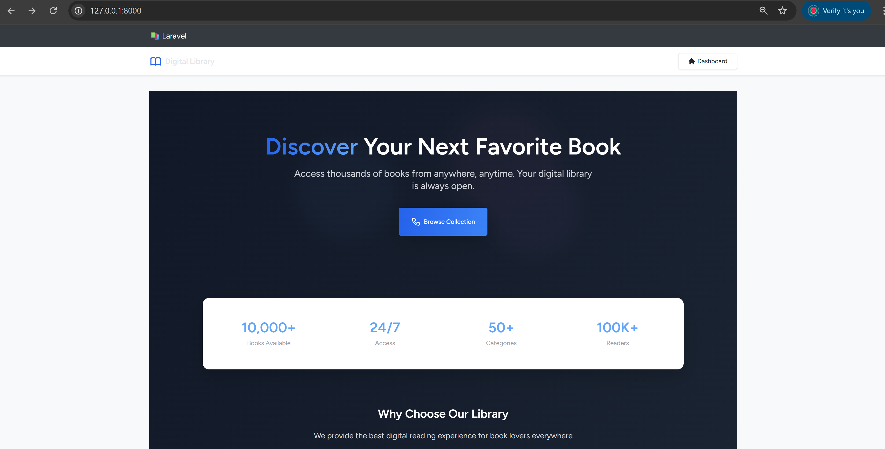

2. **📚 Featured Books Section** 
  – Highlights the most popular and newly added books.
   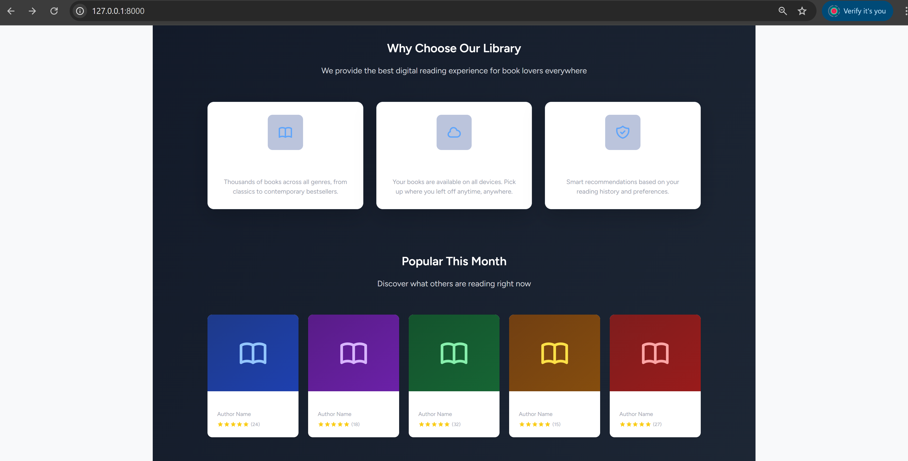

3. **🎓 Student Services Section** 
  – Quick access to student registration, borrowing, and account management.
   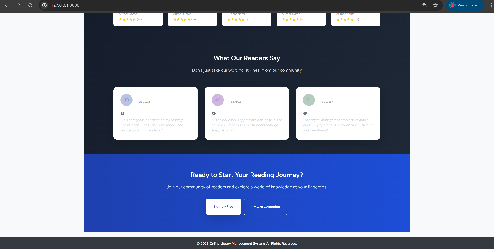

### 🛠 Admin Module
Manage the library’s core resources and users with ease.

- **📊 Admin Dashboard**
 - Overview of borrowed books, the collection, and registered users.
  - 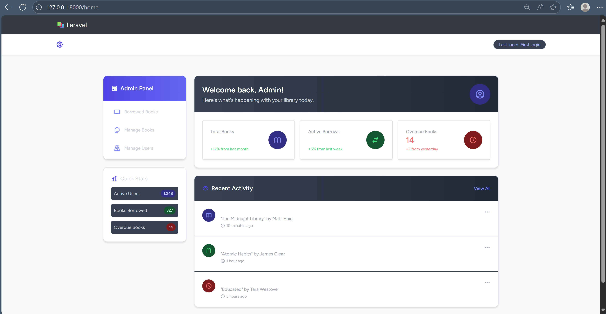

- **📚 Book Management**
  - Add, edit, or delete books from the collection.
  - 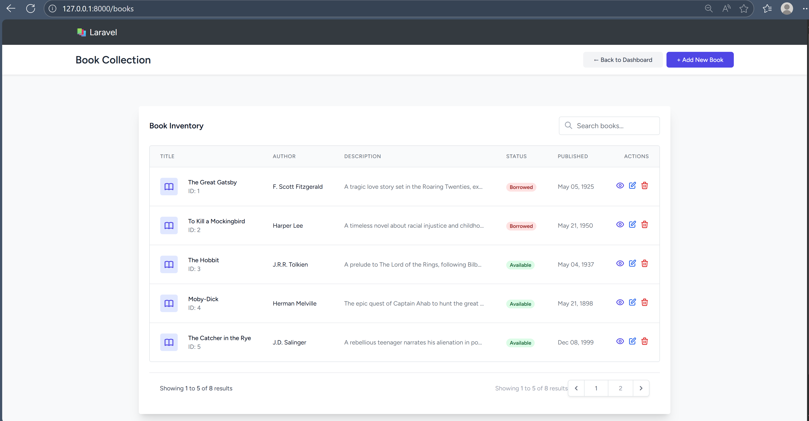


- **📖 Borrowed Books & Student Details**
  - View all borrowed books with borrower information.
  - Search and view details of students.
  - 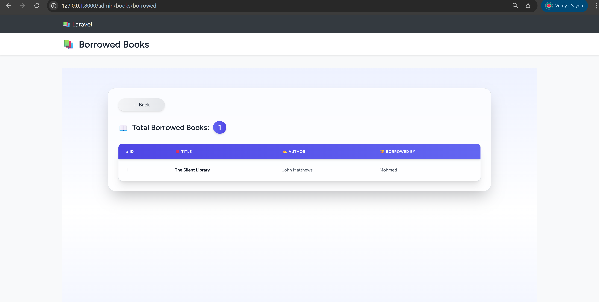
  - 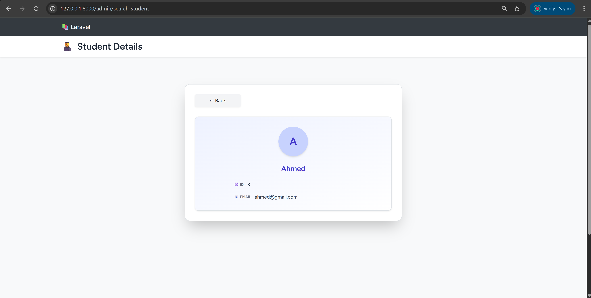


- **🎓 Student Management**
  - Search and view students by unique ID.
  - 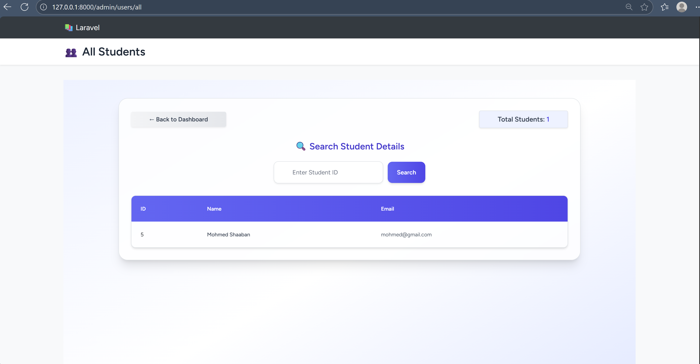

- **👤 Profile Management**
  - Edit your profile details.
  - 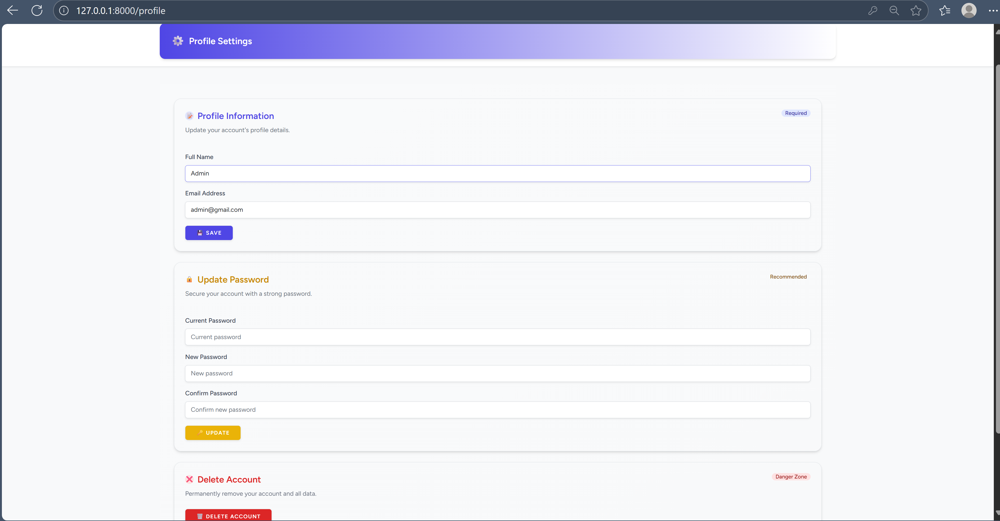

- **🔒 Access Control**
  - Restrict sensitive actions to admins only.

---

### 🎓 Student Module
Empowering students to explore, borrow, and track books.

- **📝 Registration**
  - Sign up to borrow books.
  - 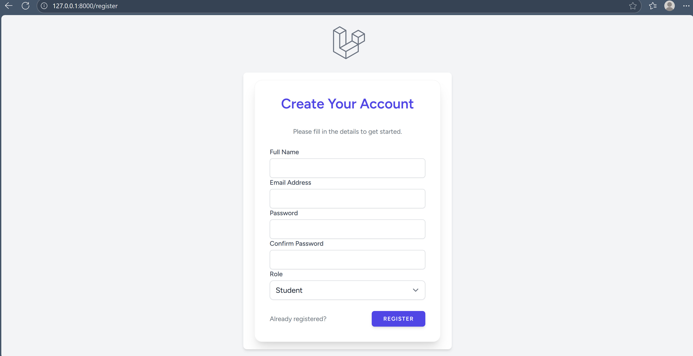

- **📖 Browse Books**
  - View all books and their details.
  - 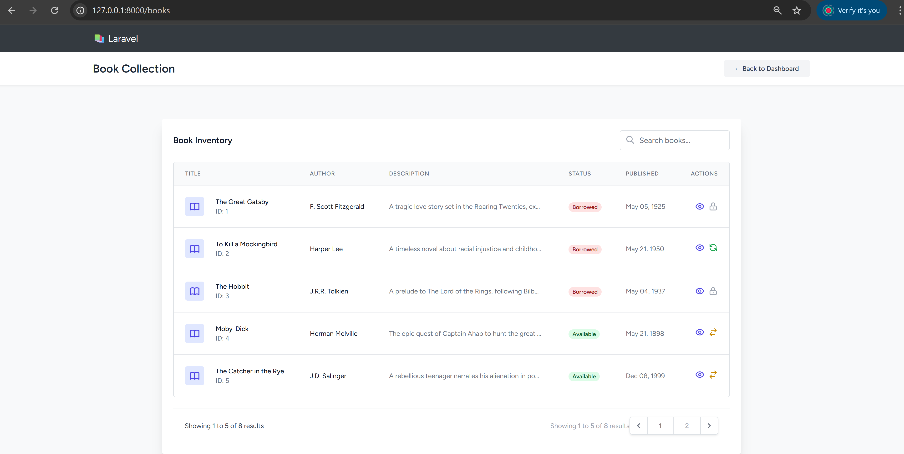

- **📥 Borrow Books**
  - Borrow available books and track them.
  - 

- **📂 Student Dashboard**
  - Manage borrowed books and returns.
  - 

- **👤 Profile Management**
  - Edit your personal profile.
  - 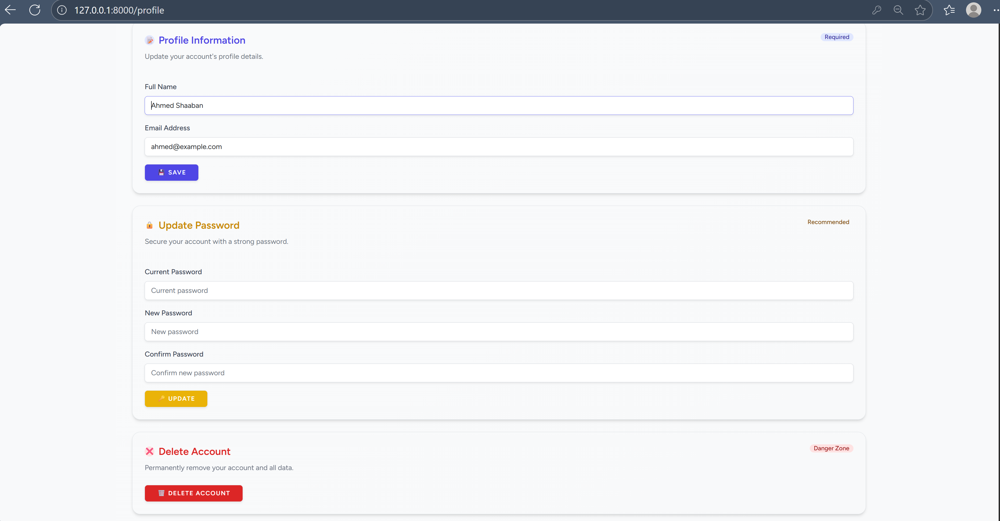

- **📜 Borrowing History**
  - View past borrowings with return dates.
  - 

---

## 🛠 Tech Stack
- **Framework:** Laravel  12
- **Frontend:** Blade Templates + TailwindCSS
- **Database:** MySQL
- **Authentication:** Laravel Breeze
- **Other Tools:** Composer, NPM

---

## 📦 Installation

1. **Clone the repository**
   ```bash
   git clone https://github.com/yourusername/online-library-management-system.git
   cd online-library-management-system
